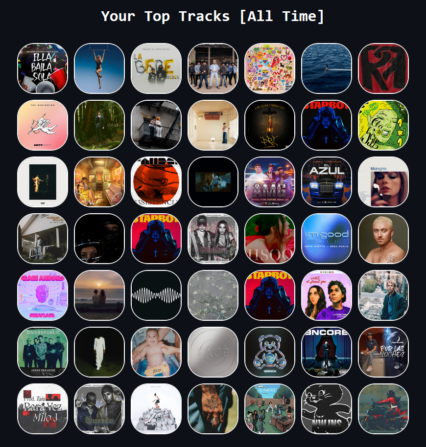
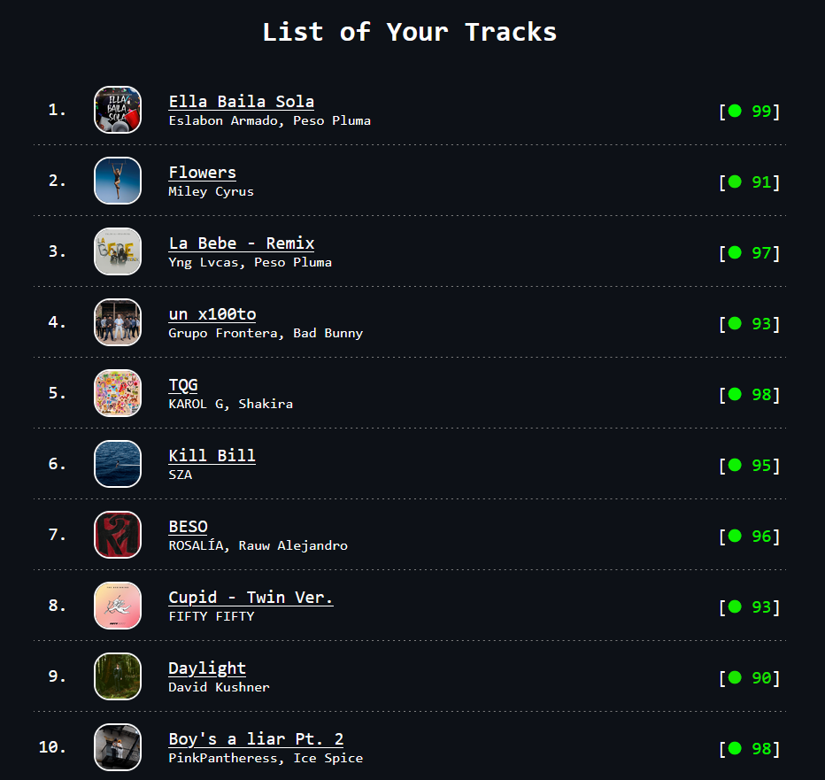

# Discover Spotify
A tool to discover your Spotify using [Spotify's API](https://developer.spotify.com/) based on [Spotipy](https://spotipy.readthedocs.io/)
- Generate new playlists based on recommendations ([Spotify for Developers: Recommendations](https://developer.spotify.com/documentation/web-api/reference/get-recommendations))
- Create a fancy overview of your top tracks and artists

## Features
### Overview of tracks and artists
This script will generate an HTML file with a representation of your top tracks/artists over a period of time. An overview looks like this:
 

 
 
Hovering over a picture shows a more detailed view:
 

 
 
A list shows the ranking of the tracks/artists and the popularity[^1] rated by Spotify:
 

 
 
### Generate new playlists based on recommendations
*Documentation will be added soon.*

## Setup
### Python requirements
Install requirements using `pip install -r requirements.txt`
### Create a Spotify Application
1. Follow the steps on [Spotify for Developers: Getting started with Web API](https://developer.spotify.com/documentation/web-api/tutorials/getting-started) until you have a **Client ID** and a **Client Secret**. Add http://localhost as "Redirect URI" in your application.
2. Add your **Client ID** and **Client Secret** to the [credentials.json](credentials.json) file

## Usage
The following scripts are independent of each other except for the **API Token generation** since it is needed for running every script.
### Create API Token
You need a valid token which is generated by the [get_token.py](get_token.py) file to use the Spotify API. A token is valid for one hour. To generate it, run the file and paste the URL from the browser into the input. Sometimes Spotipy does not ask for the URL and just creates the token.
### Overview of top tracks and artists
1. Create an API token 
2. Open [generate_pic_overview.ipynb](generate_pic_overview.ipynb) and adapt the first code block:
   - `TYPE`: The type of entity to return.[^1]
     - `track`: Get top tracks
     - `artist`: Get top artists
   - `TIME_RANGE`: Over what time frame the affinities are computed.[^1]
     - `short_term`: Last 4 Weeks
     - `medium_term`: Last 6 Months
     - `long_term`: All Time
   - `LIMIT`: The maximum amount of top items. The maximun was set to 50 by Spotify. It is possible, that Spotify does not return 50 items and the overview is therefore smaller.
     - Number from 1 to 50
3. Run the complete notebook and see generated HTML file in the folder named `generated`.
### Generate new playlists based on recommendations
*Documentation will be added soon.*

[^1]: https://developer.spotify.com/documentation/web-api/reference/get-users-top-artists-and-tracks
